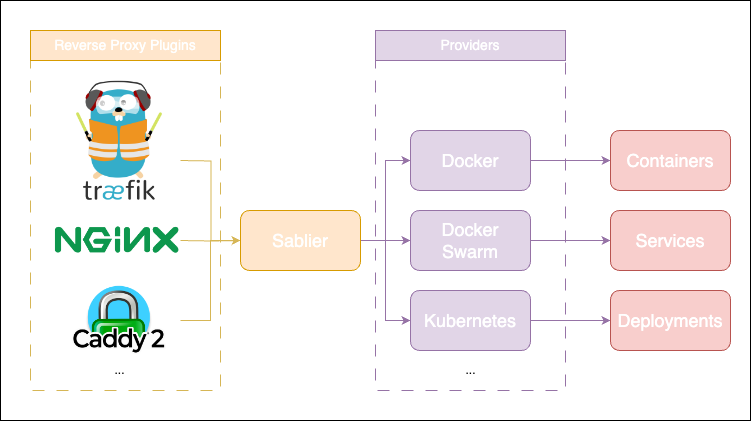

# Getting started

This Getting Started will get you through what you need to understand how to use Sablier as a scale to zero middleware with a reverse proxy.



## Identify your provider

The first thing you need to do is to identify your [Provider](/providers/overview).

?> A Provider is how Sablier can interact with your instances and scale them up and down to zero.

You can check the available providers [here](/providers/overview?id=available-providers).

## Identify your reverse proxy

Once you've identified you're [Provider](/providers/overview), you'll want to identify your [Reverse Proxy](/plugins/overview).

?> Because Sablier is designed as an API that can be used on its own, reverse proxy integrations acts as a client of that API.

You can check the available reverse proxy plugins [here](/plugins/overview?id=available-reverse-proxies)

## Connect it all together

- Let's say we're using the [Docker Provider](/providers/docker).
- Let's say we're using the [Caddy Reverse Proxy Plugin](/plugins/caddy).

### 1. Initial setup with Caddy

Suppose this is your initial setup with Caddy. You have your reverse proxy with a Caddyfile that does a simple reverse proxy on `/whoami`.

<!-- tabs:start -->

#### **docker-compose.yaml**

```yaml
services:
  proxy:
    image: caddy:2.6.4
    ports:
      - "8080:80"
    volumes:
      - ./Caddyfile:/etc/caddy/Caddyfile:ro

  whoami:
    image: containous/whoami:v1.5.0
```

#### **Caddyfile**

```Caddyfile
:80 {
	route /whoami {
		reverse_proxy whoami:80
	}
}
```

<!-- tabs:end -->

At this point you can run `docker compose up` and go to `http://localhost:8080/whoami` and you will see your service.


### 2. Install Sablier with the Docker Provider

Add the Sablier container in the `docker-compose.yaml` file.

```yaml
services:
  proxy:
    image: caddy:2.6.4
    ports:
      - "8080:80"
    volumes:
      - ./Caddyfile:/etc/caddy/Caddyfile:ro

  whoami:
    image: containous/whoami:v1.5.0

  sablier:
    image: acouvreur/sablier:1.4.1-beta.9-beta.11
    command:
        - start
        - --provider.name=docker
    volumes:
      - '/var/run/docker.sock:/var/run/docker.sock'
```

### 3. Add the Sablier Caddy Plugin to Caddy

Because Caddy does not provide any runtime evaluation for the plugins, we need to build Caddy with this specific plugin.

I'll use the provided Dockerfile to build the custom Caddy image.

```bash
docker build https://github.com/acouvreur/sablier.git#v1.4.0-beta.3:plugins/caddy 
  --build-arg=CADDY_VERSION=2.6.4
  -t caddy:2.6.4-with-sablier
```

Then change the image to from `caddy:2.6.4` to `caddy:2.6.4-with-sablier`

```yaml
services:
  proxy:
    image: caddy:2.6.4-with-sablier
    ports:
      - "8080:80"
    volumes:
      - ./Caddyfile:/etc/caddy/Caddyfile:ro

  whoami:
    image: containous/whoami:v1.5.0

  sablier:
    image: acouvreur/sablier:1.4.1-beta.9-beta.11
    command:
        - start
        - --provider.name=docker
    volumes:
      - '/var/run/docker.sock:/var/run/docker.sock'
```

### 4. Configure Caddy to use the Sablier Caddy Plugin on the `whoami` service

This is how you opt-in your services and link them with the plugin.

<!-- tabs:start -->

#### **docker-compose.yaml**

```yaml
services:
  proxy:
    image: caddy:local
    ports:
      - "8080:80"
    volumes:
      - ./Caddyfile:/etc/caddy/Caddyfile:ro

  whoami:
    image: containous/whoami:v1.5.0
    labels:
      - sablier.enable=true
      - sablier.group=demo
  
  sablier:
    image: acouvreur/sablier:local
    volumes:
      - '/var/run/docker.sock:/var/run/docker.sock'
```

#### **Caddyfile**

```Caddyfile
:80 {
	route /whoami {
      sablier url=http://sablier:10000 {
        group demo
        session_duration 1m 
        dynamic {
            display_name My Whoami Service
        }
      }

	  reverse_proxy whoami:80
	}
}
```

Here we've configured the following things when we're accessing the service on `http://localhost:8080/whoami`:
- The containers that have the label `sablier.group=demo` will be started on demand
- The period of innactivity after which the containers should be shut down is one minute
- It uses the dynamic configuration and configures the title with `My Whoami Service`

<!-- tabs:end -->

?> We've assigned the group `demo` to the service and we use this to identify the workload i